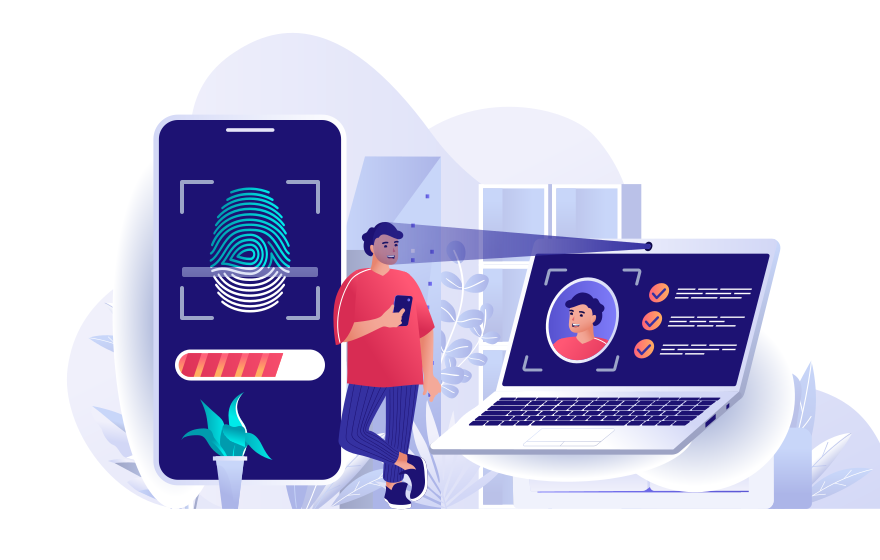

Passwordless
============

> Less passwords, more security!

<section id="userinfo" class="hidden">
  
  <h1>Hello ???!</h1>
  <pre></pre>
</section>

<section id="login" class="hidden">
  
Sign in with...

  
</section>

<link rel="stylesheet" type="text/css" href="css/sign-in-with.css">

---

 The vision
---------------------------

In the future, "Passwordless.ID" is planned to become a "free public identity provider".

An authentication platform with multiple goals:

- Make the web a safer place
- Make it easier for developers
- More comfort and control for users

---

 F.A.Q. 
-------------------------------

### Is my fingerprint/face sent to the server? 

**No.** Your fingerprint, face or other biometrics never leaves your device.
The biometric verification is a security constraint that occurs locally on your device
to create and access security keys (similar to large random passwords).

### How does it work exactly? 

It relies on [asymetric cryptography](https://en.m.wikipedia.org/wiki/Public-key_cryptography). 
Upon registration, a cryptographic key pair is generated.
The private key kept on the device, protected by biometrics,
while the public key is sent to the server.
In combination, they can be used to encrypt and decrypt messages respectively.
For more technical details about the protocol, check the webauthn guide.

### Is it more secure than passwords? 

**Yes.** It is basically a two-factor authentication in a single step. 

- The first factor is something you have. 
The authentication only works on registered devices. 
- The second factor is something you are, or something you know. 
A biometric verification, or the device PIN code, is required.

Moreover:

- It protects against phishing (article coming soon)
- The cryptographic keys are never exposed (article coming soon)

### What if my device is lost or stolen? 

Unlike traditional authentication systems with a single password,
you register multiple access keys, one per device.

If you lose your device, your lose your access key.
Therefore, it is important to either have another registered device or an appropriate recovery mechanisms.

Likewise, if your device is stolen and the thief can unlock it (for example if the pattern is trivial),
then the thief has full control over your phone and could possibly also impersonate you.
In this case, it is important to remove that device from the list of authorized devices.

---

Use it!
-------

Accessing the profile is as simple as calling `GET /userinfo`. See for yourself: https://api.passwordless.id/userinfo

The response is something like this:

    {
      "sub": "myusername",
      "nickname": "My Nickname",
      "picture": "https://ui.passwordless.id/avatars/andy.svg",
    }

Of course, this works only if:

- the user is signed in (Otherwise you receive `401 Unauthorized`)
- The user ganted access (Otherwise you receive `403 Forbidden`)

In order to let the user sign in or grant access, simply invoke `https://api.passwordless.id/authorize`.

You might also request access to a larger scope, like phone number, personal information, address...

You can also request a JWT using `GET /token` to obtain the same information as a signed token. This token is particularly useful for the server side, since the JWT signature proves the user information authenticity.

Find more information about its usage here.

